# Paradise 📺🎬

> A leanback-first Android TV app for browsing **movies** and **TV series**, powered by [The Movie Database (TMDB)](https://www.themoviedb.org/) API.

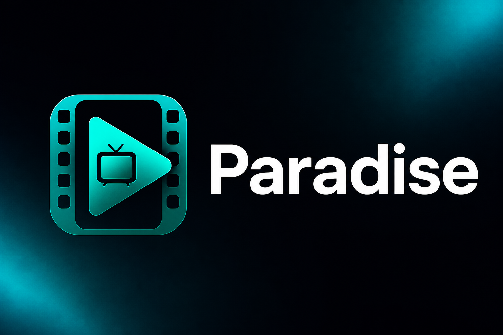

[](https://developer.android.com/tv)
[](https://www.java.com/)
[](app/build.gradle)
[](app/build.gradle)
[](LICENSE)

---

## Overview 🧭

**Paradise** is a remote-friendly entertainment catalog for Android TV, Google TV, and Android STB devices. It combines the AndroidX **Leanback** browse/details pattern with TMDB metadata, poster art, cast discovery, genre exploration, watch-provider hints, and inline trailer playback.

The app is built for the **10-foot UI**: D-pad navigation, focus-driven scrolling, shared-element poster transitions, skeleton loading states, and retryable error rows.

📖 Related article: [How to develop an Android TV app](https://medium.com/@halilozel1903/how-to-develop-android-tv-app-5e251f3aa56b)

---

## Features ✨

| Area | What you get |
|------|----------------|
| 🏠 **Home** | 8 paginated rows — 4 movie + 4 TV sections with infinite horizontal scroll |
| 🎬 **Movies** | Now Playing, Top Rated, Popular, Upcoming |
| 📡 **TV Series** | On The Air, Airing Today, Popular TV, Top Rated TV |
| 🔎 **Search** | Live movie search via `SearchSupportFragment` |
| 🏷️ **Genres** | Focusable genre chips → filtered movie grid |
| 📜 **Details** | Overview, rating, runtime, director, **Watch Trailer**, genres, watch providers, cast, recommendations |
| 👤 **Cast** | Person detail with portrait/backdrop images, filmography (Movies & Series rows) |
| ▶️ **Trailers** | WebView embed + **Open in YouTube** fallback for Android TV |
| 🎨 **UX** | Skeleton loaders, empty states, retry cards, dynamic palette-based hero background |
| 🎯 **Focus** | Google TV–aligned Leanback focus (1.05× zoom + glow), chip outline rows for tags |

---

## Tech Stack 🛠️

| Layer | Libraries |
|-------|-----------|
| 🧱 **UI** | AndroidX Leanback, AppCompat, CardView, Palette, SplashScreen |
| 🌐 **Networking** | Retrofit 3, OkHttp 5, Gson |
| ⚡ **Async** | RxJava 3, RxAndroid |
| 🖼️ **Images** | Glide 5 |
| 💉 **DI** | Dagger 2 |
| ▶️ **Playback** | WebView (YouTube embed) + external YouTube intent fallback |

---

## Architecture 🏗️

```
┌─────────────────────────────────────────────────────────────┐
│  Activities                                                  │
│  MainActivity · SearchActivity · MediaDetailActivity        │
│  PersonDetailActivity · GenreMoviesActivity · PlayerActivity  │
└──────────────────────────┬──────────────────────────────────┘
                           │
┌──────────────────────────▼──────────────────────────────────┐
│  Fragments (Leanback)                                        │
│  MainFragment · SearchFragment · DetailFragment              │
│  TvDetailFragment · PersonDetailFragment · GenreMoviesFragment│
└──────────────────────────┬──────────────────────────────────┘
                           │
         ┌─────────────────┼─────────────────┐
         ▼                 ▼                 ▼
   Presenters        RowLoadingHelper    TheMovieDbAPI
   CardViews         UiStateItem         (Retrofit)
   TagListRow        RecommendationRowHelper
```

- **MVP** on browse/search/genre flows (`MainContract`, `SearchContract`, `GenreMoviesContract`)
- **Presenter / ViewHolder** pattern for Leanback rows and cards
- **Dagger** `ApplicationComponent` injects API + presenters into fragments
- **RxJava** disposables cleaned up in `onDestroy()` / `BaseRxPresenter`

### Key packages 📦

```
com.halil.ozel.movieparadise
├── data/           # TMDB API + models
├── dagger/         # App-wide DI graph
├── ui/
│   ├── main/       # Browse home + pagination
│   ├── search/     # Voice/text search
│   ├── detail/     # Movie detail, cast, tags, trailers
│   ├── tv/         # TV show detail
│   ├── genre/      # Genre-filtered grid
│   ├── person/     # Cast member detail
│   ├── player/     # Trailer WebView
│   ├── common/     # Loading/error/empty cards
│   └── base/       # Focus helpers, Glide, palette utils
```

---

## Screens 📸

### 🏡 Home — Browse rows

Eight TMDB-powered rows with skeleton loading, pagination, and a dynamic background driven by the focused poster (Palette API).


| Row | Content |
|-----|---------|
| ▶️ Now Playing | Currently in theatres |
| 🔝 Top Rated | Highest-rated movies |
| 🥳 Popular | Trending movies |
| 🔜 Upcoming | Soon-to-release movies |
| 📡 On The Air | TV shows airing now |
| 📅 Airing Today | Episodes today |
| 📺 Popular TV | Trending series |
| ⭐ Top Rated TV | Highest-rated series |

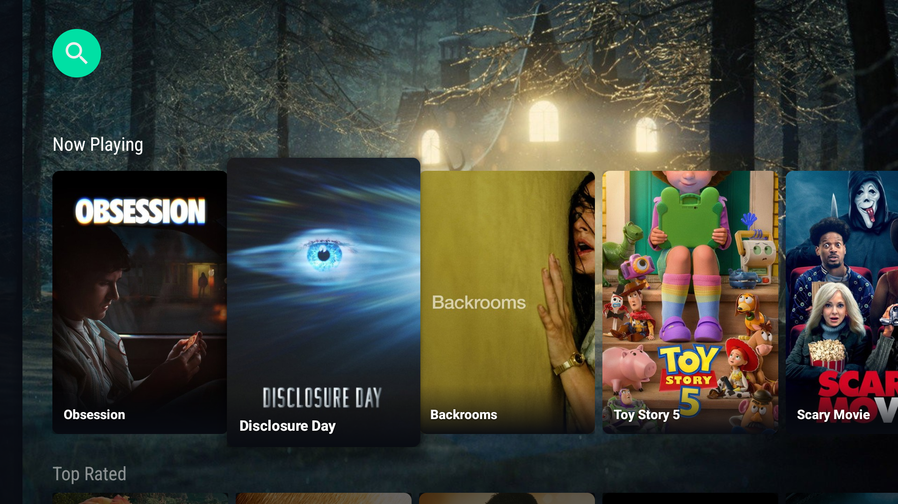

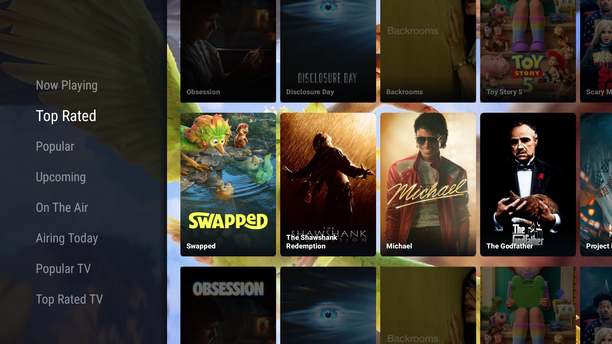

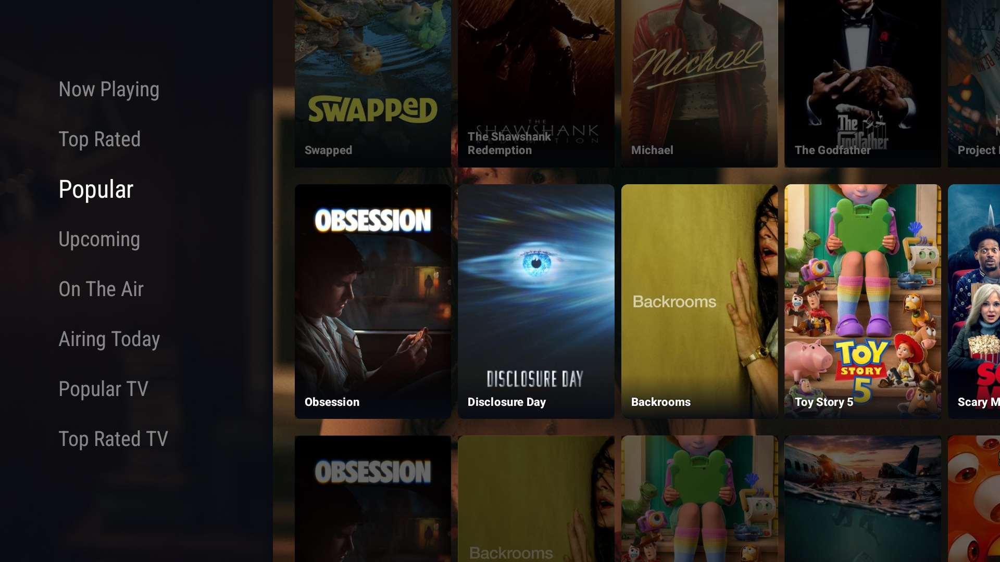

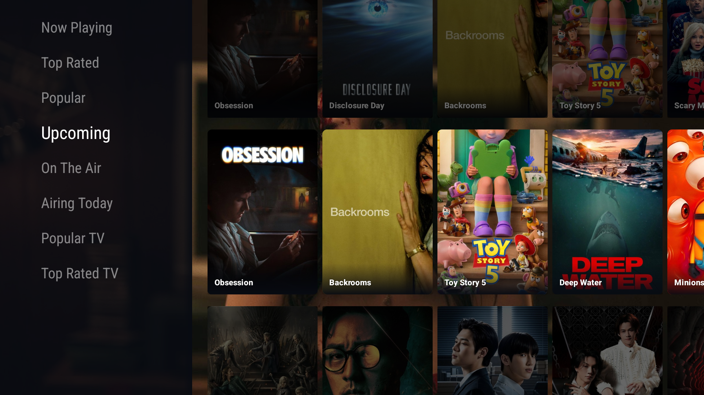

---

### 📜 Detail — Movies & Series

Full-width `DetailsOverviewRow` with poster, metadata, **Watch Trailer** action, focusable **Genres** and **Where to Watch** chip rows, cast rail, and merged recommendations/similar titles.

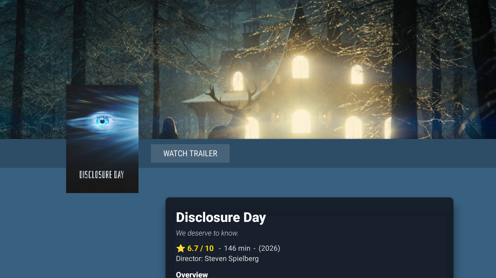

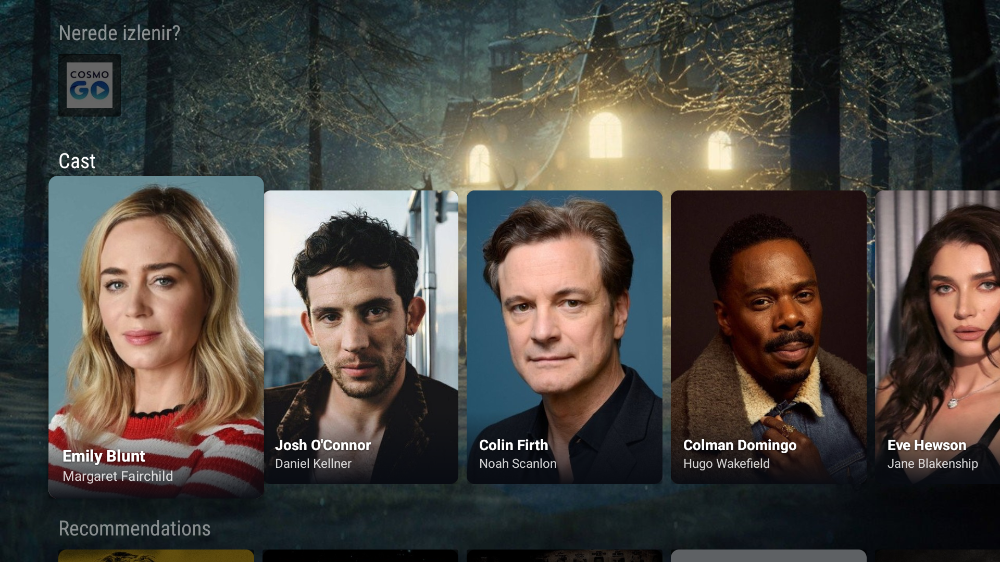

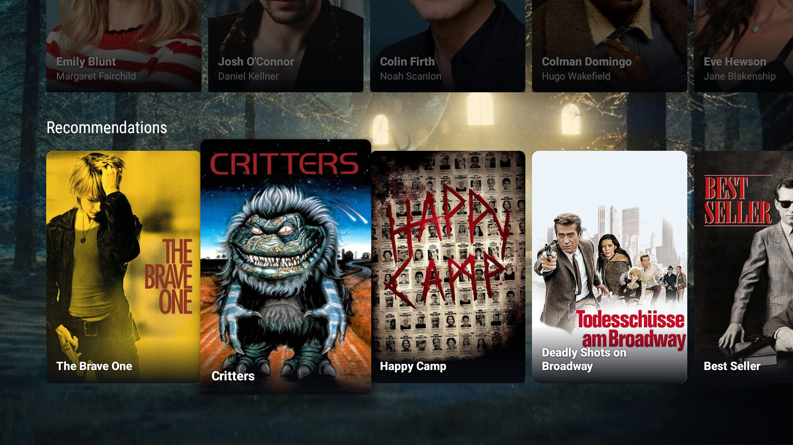

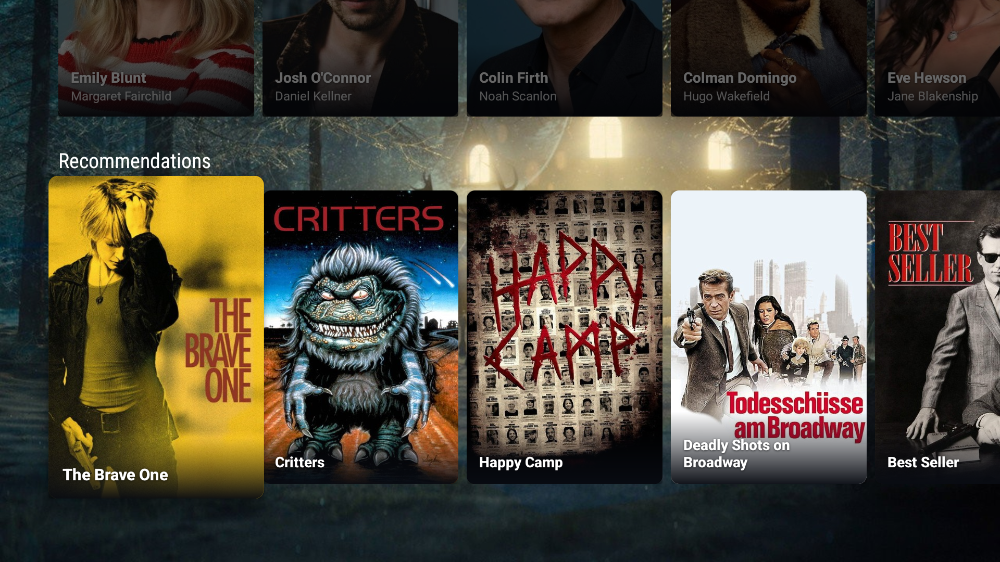

---

### 🔎 Search

Leanback search fragment with debounced TMDB queries, loading skeletons, and instant navigation to detail.

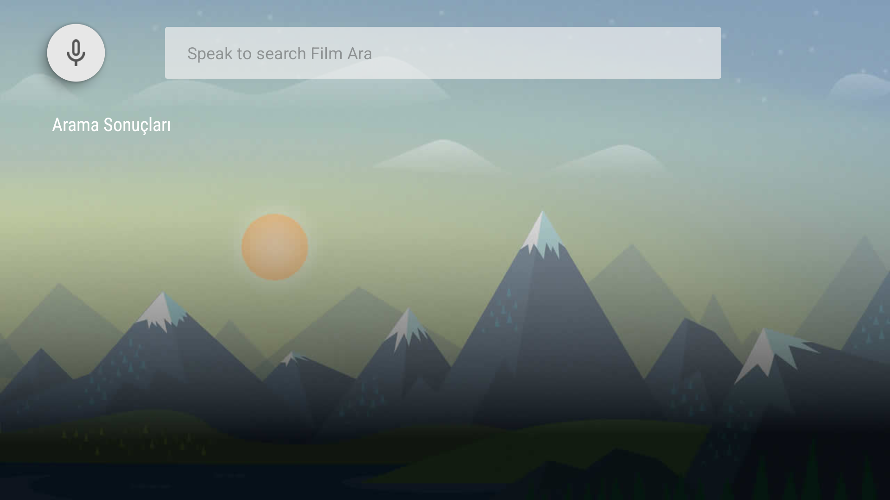

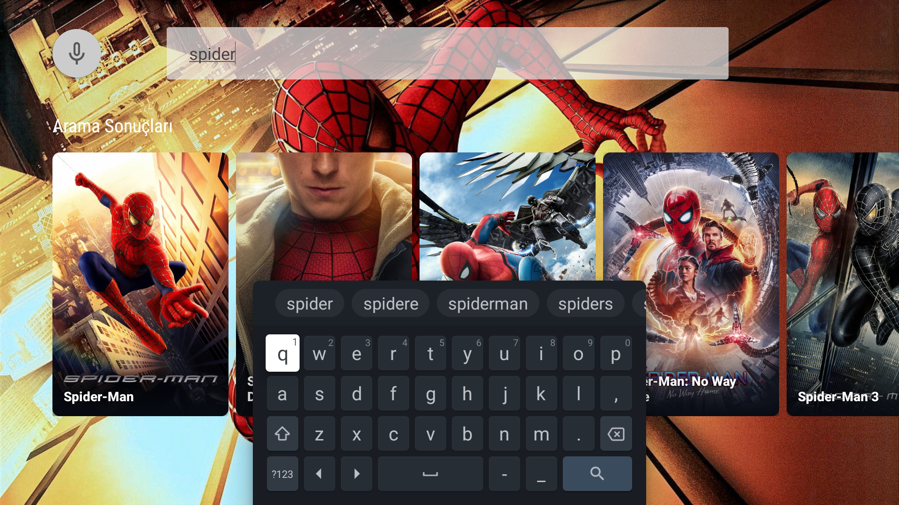

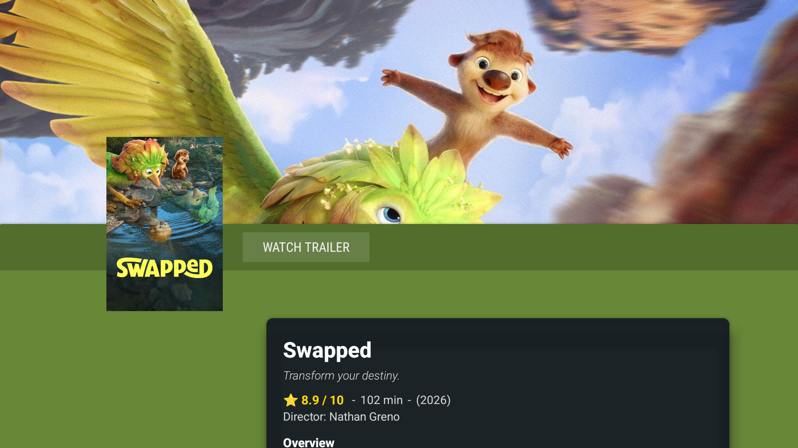

---

### 📺 Android TV launcher

Leanback launcher entry with TV banner and landscape orientation.

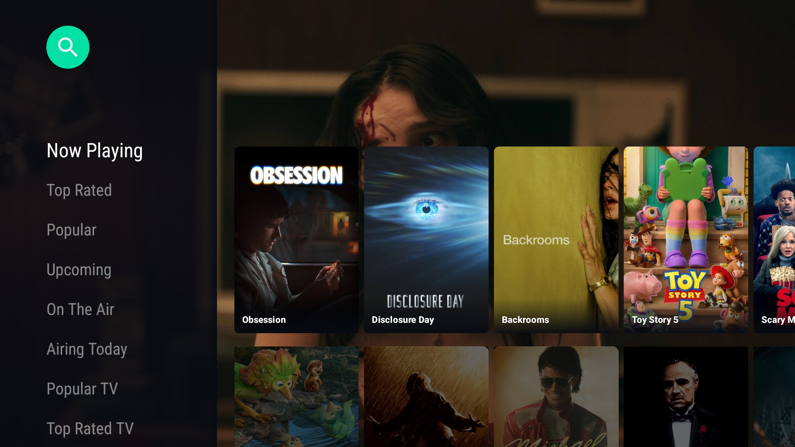

---

## Getting Started 🚀

### Requirements

- Android Studio Ladybug or newer 🐘
- JDK **17**
- Android SDK **36**
- TMDB API key ([get one here](https://www.themoviedb.org/settings/api))

### 1. Clone

```bash
git clone https://github.com/halilozel1903/AndroidTVMovieParadise.git
cd AndroidTVMovieParadise
```

### 2. Configure API key 🔑

Set your TMDB key in `app/src/main/java/com/halil/ozel/movieparadise/Config.java`:

```java
public static final String API_KEY_URL = "YOUR_TMDB_API_KEY";
```

### 3. Build & run ▶️

```bash
./gradlew assembleDebug
```

Install on an **Android TV emulator** or device with `LEANBACK_LAUNCHER` support. All dependencies resolve from **Maven Central** — no extra repositories required.

```bash
adb install app/build/outputs/apk/debug/app-debug.apk
```

---

## TMDB Integration 🌐

| Endpoint | Usage |
|----------|--------|
| `/movie/*` | Home rows, detail, recommendations, videos, providers |
| `/tv/*` | TV rows, show detail, credits, recommendations, videos |
| `/search/movie` | Search screen |
| `/discover/movie` | Genre filtering |
| `/person/*` | Cast detail, images, filmography |

Documentation: https://www.themoviedb.org/documentation/api

---

## TV Focus System 🎯

Focus behavior follows [Google TV focus guidelines](https://developer.android.com/design/ui/tv/guides/styles/focus-system):

- **Poster cards** — Leanback `FocusHighlight.ZOOM_FACTOR_SMALL` (1.05×) + white glow (`lb_default_brand_color`)
- **Genre / provider chips** — `TagListRow` with selector drawables (outline only, no zoom flicker)
- **State cards** — Retry / empty / error with `card_focus_border` foreground

Helpers: `TvRows`, `TvFocusHelper`, `BindableCardView`

---

## Trailer Playback ▶️

1. TMDB `/videos` → YouTube key via `TrailerHelper`
2. `PlayerActivity` loads YouTube embed in hardware-accelerated WebView
3. On failure → **Open in YouTube** (TV or mobile app intent, no immediate `finish()`)

---

## Project Info ℹ️

| | |
|---|---|
| **App name** | Paradise |
| **Package** | `com.halil.ozel.movieparadise` |
| **Version** | 1.5 (versionCode 5) |
| **Min SDK** | 24 (Android 7.0) |
| **Target SDK** | 36 |

---

## Resources 📚

- [How to develop Android TV App?](https://halilozel1903.medium.com/how-to-develop-android-tv-app-5e251f3aa56b) ✍️
- [Android TV Developer Guide](https://developer.android.com/tv/) 📺
- [Building an Android TV app (Marcus)](https://medium.com/@Marcus_fNk/building-an-android-tv-app-part-1-7f59b3747446) 🏗️
- [Leanback Library](https://developer.android.com/reference/androidx/leanback/package-summary) 📐

---

## Support ☕

If this project helped you, consider buying me a coffee:

[](https://www.buymeacoffee.com/halilozel1903)

---

## License 📄

```
MIT License

Copyright (c) 2023 Halil OZEL

Permission is hereby granted, free of charge, to any person obtaining a copy
of this software and associated documentation files (the "Software"), to deal
in the Software without restriction, including without limitation the rights
to use, copy, modify, merge, publish, distribute, sublicense, and/or sell
copies of the Software, and to permit persons to whom the Software is
furnished to do so, subject to the following conditions:

The above copyright notice and this permission notice shall be included in all
copies or substantial portions of the Software.

THE SOFTWARE IS PROVIDED "AS IS", WITHOUT WARRANTY OF ANY KIND, EXPRESS OR
IMPLIED, INCLUDING BUT NOT LIMITED TO THE WARRANTIES OF MERCHANTABILITY,
FITNESS FOR A PARTICULAR PURPOSE AND NONINFRINGEMENT. IN NO EVENT SHALL THE
AUTHORS OR COPYRIGHT HOLDERS BE LIABLE FOR ANY CLAIM, DAMAGES OR OTHER
LIABILITY, WHETHER IN AN ACTION OF CONTRACT, TORT OR OTHERWISE, ARISING FROM,
OUT OF OR IN CONNECTION WITH THE SOFTWARE OR THE USE OR OTHER DEALINGS IN THE
SOFTWARE.
```
